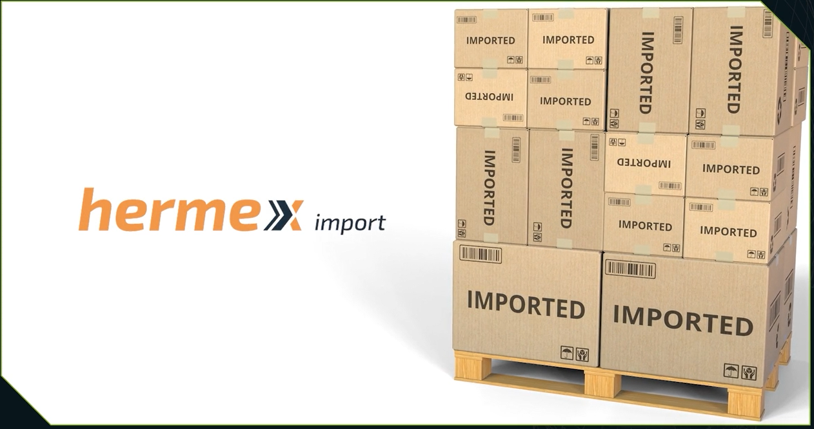

# Banco de dados
O projeto tem a missão de desenvolver um banco de dados para uma empresa de importação, a Hermex Import.

  
   
  <em></em>

A empresa já forneceu algumas tabelas, alguns dados internos, e deseja conseguir tirar insights valiosos que serão utilizados nas campanhas, nas ações que ela vai tomar daqui para frente.

## Ferramentas e Tecnologias
O projeto utiliza a linguagem SQL. SQL vem do termo em Inglês "Structured Query Language" (Linguagem de Consultas Estruturadas). É uma linguagem que consegue fazer consultas em bancos de dados relacionais.

Para tal, é escolhido o SGBD [SQLite Online](sqliteonline.com), que tem a vantagem de não precisar de instalação, como a maioria dos SGBDs que exigem um trabalho para fazer instalação.

## Referências Bibliográficas
1. [Formação SQL](https://cursos.alura.com.br/formacao-conhecendo-sql)

2. [Beatriz Magalhães](https://cursos.alura.com.br/user/beatriz280197)

3. [O que é SQL e por que aprender SQL é essencial para você?](https://cursos.alura.com.br/extra/alura-mais/o-que-e-sql-e-por-que-aprender-sql-e-essencial-para-voce--c9092)

4. [SQL: consultas com SELECT](https://www.alura.com.br/artigos/sql-consultas-com-select?_gl=1*6my4rj*_ga*MTQyMTIxMDgxOS4xNzE0Mzk3MzI0*_ga_1EPWSW3PCS*MTcxNDQwNDc5OS42LjEuMTcxNDQwNDgwMC4wLjAuMA..*_fplc*MFVVY0U2ZlEzUThkQXVzZW84ZGRmSTdzdTNvV0VSTDhZdGVqZHBLdmk0TnJsSmRodlVaWnE5RThYcGxGR3RFb3htbmdWVUExa0k4UFRaTUJSRFoxeXpmbzJmWHpOaWd0V2l1NTdBYlhkZkpwSXVxaTdyYmlHTTA3R25POXdRJTNEJTNE)

5. [SQL: cláusulas UPDATE e DELETE](https://www.alura.com.br/artigos/sql-clausulas-update-e-delete?_gl=1*1nuwqbm*_ga*MTQyMTIxMDgxOS4xNzE0Mzk3MzI0*_ga_1EPWSW3PCS*MTcxNDQwNDc5OS42LjEuMTcxNDQwNDk0OC4wLjAuMA..*_fplc*MFVVY0U2ZlEzUThkQXVzZW84ZGRmSTdzdTNvV0VSTDhZdGVqZHBLdmk0TnJsSmRodlVaWnE5RThYcGxGR3RFb3htbmdWVUExa0k4UFRaTUJSRFoxeXpmbzJmWHpOaWd0V2l1NTdBYlhkZkpwSXVxaTdyYmlHTTA3R25POXdRJTNEJTNE)

6. [SQL e NoSQL: trabalhando com bancos relacionais e não relacionais](https://www.alura.com.br/artigos/sql-nosql-bancos-relacionais-nao-relacionais?_gl=1*1hc4clp*_ga*MTQyMTIxMDgxOS4xNzE0Mzk3MzI0*_ga_1EPWSW3PCS*MTcxNDQwNDc5OS42LjEuMTcxNDQwNTA1Ny4wLjAuMA..*_fplc*MFVVY0U2ZlEzUThkQXVzZW84ZGRmSTdzdTNvV0VSTDhZdGVqZHBLdmk0TnJsSmRodlVaWnE5RThYcGxGR3RFb3htbmdWVUExa0k4UFRaTUJSRFoxeXpmbzJmWHpOaWd0V2l1NTdBYlhkZkpwSXVxaTdyYmlHTTA3R25POXdRJTNEJTNE) 